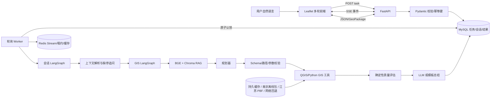

# GeoAI-QGIS Final：完整架构、案例与技术说明

## 1. 项目定位

项目把“自然语言 GIS 需求”转换为“可验证、可追踪、可下载的空间分析结果”。它不是让 LLM 直接计算几何，而是让 LLM/规则规划器选择受控工具；空间计算由 QGIS Processing、GeoPandas/Shapely 等确定性代码执行。

最终版边界：面向教学、工程原型和 Agent 应用开发演示；项目内置的 OSM 快照和网络增量数据都不等于权威测绘数据，选址结果也不代替真实规划决策。

## 2. 端到端流程

### 2.1 前端到 FastAPI

前端先创建/恢复会话，再调用 `POST /api/v1/tasks`。请求模型检查 query、user_id、conversation_id；`Idempotency-Key` 与 user_id 有唯一约束，浏览器重试不会重复创建相同任务。API 只写入 `PENDING` 并立即返回 202，不等待 GIS 完成。

### 2.2 MySQL 队列与 Worker

MySQL 同时承担业务持久化和轻量队列。Worker 每隔约 2 秒尝试原子认领最早的 PENDING 任务，写入 worker_id、RUNNING 与时间戳，再在进程外执行。这样 FastAPI 可持续响应，任务即使 API 重启仍在数据库中。

没有采用 Celery/ARQ 的原因是最终项目是单机/小规模 GIS 原型：MySQL 已是必需依赖，减少 Redis Broker、序列化协议和额外运维面更容易解释。Redis 在最终版只做加速和观测，未来若扩到多个 GIS Worker、优先级队列或定时任务，再迁移 Celery/ARQ 更合理。

### 2.3 双层 LangGraph

- 外层会话图：解析历史槽位，决定直接回答、要求补充区域/距离，或进入内层 GIS 图；SQLite Checkpointer 使用 conversation_id 作为 thread_id。
- 内层 GIS 图：`retrieve -> plan -> validate -> execute -> evaluate -> summarize`。验证失败可回到计划节点，执行失败进入有界重试或错误节点，避免无限循环。

### 2.4 RAG、记忆和缓存的区别

- RAG：从公共 GIS 工具知识中找“该怎么做”，不保存用户隐私。
- 会话记忆：在 MySQL/Checkpointer 中保存“这个用户刚才说了什么、当前区域和距离是什么”。
- Redis 缓存：保存可重建的进度/结果副本，丢失后不影响 MySQL 事实。

## 3. 工具与数据

| 类别 | 代表能力 | 主要实现 |
|---|---|---|
| 行政区 | 面积、相邻区 | GeoPandas/Shapely、固定评测数据 |
| POI | 计数、密度、最近邻 | OSM + Python GIS |
| 覆盖 | 单环服务区、覆盖盲区、多环覆盖 | Buffer、Union、Difference、面积统计 |
| 道路 | 密度、最近距离、周边总长度 | OSM 主要道路、QGIS/Python |
| 选址 | 基础和高级多条件选址 | 距离约束、避让区、加权评分 |

### 3.1 统一数据获取层

四类运行时数据共用同一优先级：

1. 先命中 `outputs/data_cache` 中的标准化整层或成功分块；
2. 若本地已准备数据，南京任务读取 `data/osm/nanjing` 的行政区、11 类 POI、主干道路和水系 GPKG；
3. 其他江苏范围可读取用户自行配置的 `data/osm/jiangsu-latest.osm.pbf`；
4. 本地快照不覆盖时才访问 Nominatim、OSM Shortbread 或 Overpass。

离线包解决的是“公网不可用时仍能完成可复现实验”，PBF 解决的是“换范围后仍有本地原始数据兜底”。这些运行数据不提交到 Git，由用户按 `data/osm/README.md` 在本地准备。网络请求使用原子缓存写入、响应大小校验、指数退避、端点熔断和有限重试；POI 按地理网格保存成功分块，失败重试不会从头下载。结果图层写入 `data_source`、`snapshot_modified_at`、瓦片完整度等血缘字段。

道路只保留 motorway、trunk、primary、secondary 及 link。准备南京离线包后默认直接读取本地标准化图层；没有本地数据时才进入矢量瓦片/Overpass 的区域、分块、端点次数、单请求与总预算控制。外部故障会有界失败而不是让 Worker 永久占用。

## 4. 完整案例

### 案例 A：多轮服务覆盖与道路分析

1. 用户：“分析南京市医院 1 公里服务覆盖范围。”
2. 上下文解析得到 region=南京市、poi=hospital、distance=1000。
3. 规划器生成：下载边界 -> 下载医院 -> 投影 -> Buffer -> Clip/Union -> 面积统计。
4. 用户追问：“改成公园，并计算覆盖区内主要道路长度。”
5. 外层图继承南京市与 1 公里，把对象改为 park；内层图追加主要道路获取和线长统计。
6. SSE 逐项显示工具状态；最终返回总结、地图图层和 GeoPackage。

### 案例 B：服务盲区

“找出南京市消防站 2 公里服务范围之外的区域。”工作流先合并消防站 Buffer，再用行政区 Difference 覆盖区，输出 covered/uncovered 面积和 coverage_percent。该结果是几何覆盖，不等同于真实路网行驶时间。

### 案例 C：多环覆盖

“分析南京市地铁站 500、1000、2000 米多环覆盖。”工具逐级计算累积覆盖面积和新增边际覆盖，可用于解释站点服务随距离增加的变化。

## 5. 异常处理与降级

| 故障 | 处理方式 | 是否保留事实 |
|---|---|---|
| Redis 不可用 | JSONL 进度 + 本地心跳 + MySQL 结果 | 是 |
| Worker 未运行 | readiness 失败；等待超过宽限后标记 WORKER_UNAVAILABLE | 是 |
| 排队过久 | 启动时清理为 QUEUE_EXPIRED | 是 |
| DeepSeek 不可用 | 受支持模板可规则规划/模板总结；否则明确失败 | 是 |
| OSM 公网不可用 | 使用已准备的南京离线包/江苏 PBF；否则有界失败 | 是 |
| 网络分块部分失败 | 复用成功分块；达到阈值则显式标记 partial，否则失败 | 是 |
| QGIS 命令失败 | 记录 stderr/算法/节点；任务 FAILED | 是 |
| BGE Reranker 不可用 | 保留向量 Top-K；严格模式关闭时继续 | 是 |
| 非法路径/参数 | 在执行前拒绝，不允许越出工作目录 | 不产生结果 |

降级不是把失败伪装成成功：所有 fallback 都会在健康检查、事件或结果说明中暴露。

## 6. 验证证据

- `python -m unittest discover -s tests -v`：75 项离线测试通过，覆盖 API、幂等、会话隔离、追问、规划 Schema、路径保护、重试/熔断、离线包无网络执行、结果评估及新增工具。
- `python scripts/evaluate.py --retrieval`：本地 BGE 6 例 Recall@4=0.917、MRR=1.000。
- `python scripts/evaluate.py --check-runtime`：服务启动后验证 MySQL、Redis、Chroma、QGIS、Worker。
- 关闭业务缓存的数据层回放：南京边界 0.952 s、地铁站 0.089 s、主干道路 0.293 s、水系 0.206 s，全部命中离线包且网络请求次数为 0。
- 完整 LangGraph 回放：“分析南京市地铁站空间密度”成功得到 260 个站点要素/308 个网格；“统计南京市高校周边 1 公里主要道路总长度”成功得到 923.84 km；两者均通过 Evaluator，并在答案中披露快照时间。
- 真实 DeepSeek 和外部 OSM 刷新不放进默认 CI，因为供应商配额与网络波动会制造不稳定回归；它们应作为发布前 opt-in smoke test。

## 7. 面试时应能讲清的技术点

1. 为什么 API 与 Worker 分离，以及同步函数、async I/O、长耗时 CPU/外部进程的区别。
2. MySQL 任务表的状态机、原子认领、幂等键和崩溃恢复。
3. LangGraph 是控制流；LangChain/模型客户端是组件集成；GIS 计算本身不是 LLM。
4. CRS 为什么重要：距离/面积必须转到合适的投影坐标系，不能直接用经纬度度数。
5. Buffer、Clip、Union、Difference、空间连接和最近邻分别解决什么问题。
6. SSE 是服务端单向推送；Redis Stream 是内部事件镜像，两者不是一回事。
7. RAG 检索指标和端到端答案正确率的区别。
8. 为什么“重试”不能根治第三方网络故障，以及离线包、原始 PBF、标准化缓存、网络增量四层各自解决什么问题。

## 8. 学习资料

- FastAPI async：https://fastapi.tiangolo.com/async/
- LangGraph：https://docs.langchain.com/oss/python/langgraph/overview
- SQLAlchemy 2.0：https://docs.sqlalchemy.org/en/20/tutorial/
- MySQL 8.4：https://dev.mysql.com/doc/refman/8.4/en/
- Redis Python：https://redis.io/docs/latest/develop/clients/redis-py/
- Docker Compose：https://docs.docker.com/compose/
- GeoPandas：https://geopandas.org/en/stable/docs/
- QGIS Processing：https://docs.qgis.org/latest/en/docs/user_manual/processing/
- Sentence Transformers：https://www.sbert.net/
- Chroma：https://docs.trychroma.com/
- SSE：https://developer.mozilla.org/en-US/docs/Web/API/Server-sent_events

建议顺序：HTTP/FastAPI -> SQL/MySQL/事务 -> Worker 状态机 -> GeoPandas/CRS/空间操作 -> LangGraph -> RAG/检索指标 -> Redis/Docker/可观测性。
